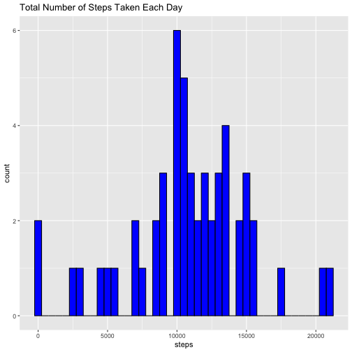
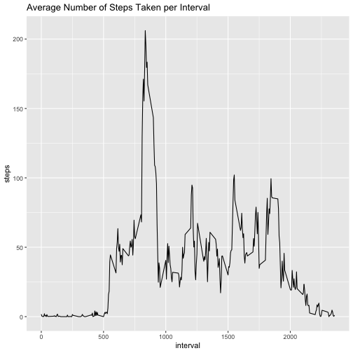
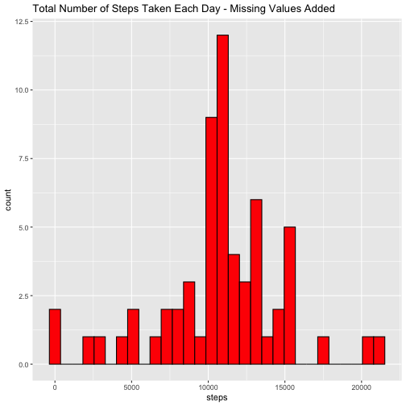
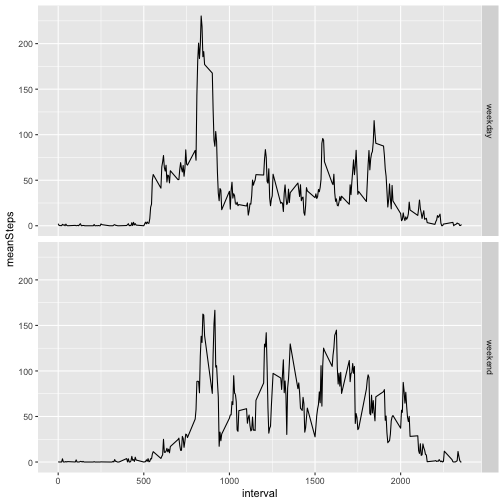

## Load and preprocessing the data


``` r
zipfile <- "activity.zip"
if(!file.exists(zipfile)) {
    
    zipURL <- "https://d396qusza40orc.cloudfront.net/repdata%2Fdata%2Factivity.zip"
    
    download.file(url=zipURL,destfile=zipfile)
}

if(!(file.exists("activity.csv"))) { 
    unzip(zipfile) 
}

activity <- read.csv("activity.csv")

summary(activity)
```

```
##      steps            date              interval     
##  Min.   :  0.00   Length:17568       Min.   :   0.0  
##  1st Qu.:  0.00   Class :character   1st Qu.: 588.8  
##  Median :  0.00   Mode  :character   Median :1177.5  
##  Mean   : 37.38                      Mean   :1177.5  
##  3rd Qu.: 12.00                      3rd Qu.:1766.2  
##  Max.   :806.00                      Max.   :2355.0  
##  NA's   :2304
```

## What is Mean total number of steps taken per day?

#### The total number of steps taken per day

``` r
library(ggplot2)
activity_per_day <- aggregate(steps~date,activity, sum, na.rm=TRUE)

ggplot(data = activity_per_day) +
    geom_histogram(aes(steps),binwidth = 500, fill = 'blue', col = 'black') +
    ggtitle("Total Number of Steps Taken Each Day")
```



#### The mean of the total number of steps taken per day

``` r
mean(activity_per_day$steps)
```

```
## [1] 10766.19
```

#### The median of the total number of steps taken per day

``` r
median(activity_per_day$steps)
```

```
## [1] 10765
```

## What is the average daily activity pattern?

#### The time series plot of the 5-minute interval (x-axis) and the average number of steps taken, averaged across all days (y-axis)

``` r
activity_per_interval <- aggregate(steps~interval, activity, mean, na.rm=TRUE)

ggplot(data = activity_per_interval) + 
    geom_line(aes(interval,steps)) +
    ggtitle("Average Number of Steps Taken per Interval")
```



#### The 5-minute interval, on average across all the days in the dataset, contains the maximum number of steps?

``` r
activity_per_interval[which.max(activity_per_interval$steps), ]$interval
```

```
## [1] 835
```

## Imputing missing values

#### The total number of missing values in the dataset

``` r
sum(is.na(activity$steps))
```

```
## [1] 2304
```

#### A new dataset that is equal to the original dataset but with the missing data filled in

``` r
activity_filled <- activity

activity_filled$steps <- ifelse(is.na(activity_filled$steps) == TRUE, activity_per_interval$steps[activity_per_interval$interval %in% activity_filled$interval], activity_filled$steps)

sum(is.na(activity_filled$steps))
```

```
## [1] 0
```

#### The histogram of the total number of steps taken each day

``` r
activity_filled2 <- aggregate(steps~date, activity_filled, sum)

ggplot(data = activity_filled2) +
    geom_histogram(aes(steps), fill = 'red', col = 'black') +
    ggtitle("Total Number of Steps Taken Each Day - Missing Values Added")
```

```
## `stat_bin()` using `bins = 30`. Pick better value with `binwidth`.
```



#### The mean of the total number of steps taken per day

``` r
mean(activity_filled2$steps)
```

```
## [1] 10766.19
```

#### The median of the total number of steps taken per day

``` r
median(activity_filled2$steps)
```

```
## [1] 10766.19
```

## Are there differences in activity patterns between weekdays and weekends?

#### A new factor variable in the dataset with two levels – “weekday” and “weekend” indicating whether a given date is a weekday or weekend day

``` r
activity_filled$date <- as.Date(activity_filled$date, format = "%Y-%m-%d")

activity_filled$weekdayType <- ifelse(weekdays(activity_filled$date) 
                                      %in% c("Saturday", "Sunday"), 
                                      "weekend", "weekday")
```

#### Make a panel plot containing a time series plot of the 5-minute interval (x-axis) and the average number of steps taken, averaged across all weekday days or weekend days (y-axis)

``` r
library(tidyverse)

activity_filled3 <- activity_filled %>% group_by(interval, weekdayType) %>%
                    summarise(meanSteps = mean(steps))
```

```
## `summarise()` has grouped output by 'interval'. You can override using the `.groups` argument.
```

``` r
ggplot(data = activity_filled3) +
       geom_line(aes(interval, meanSteps)) +
       facet_grid(weekdayType~.)
```


